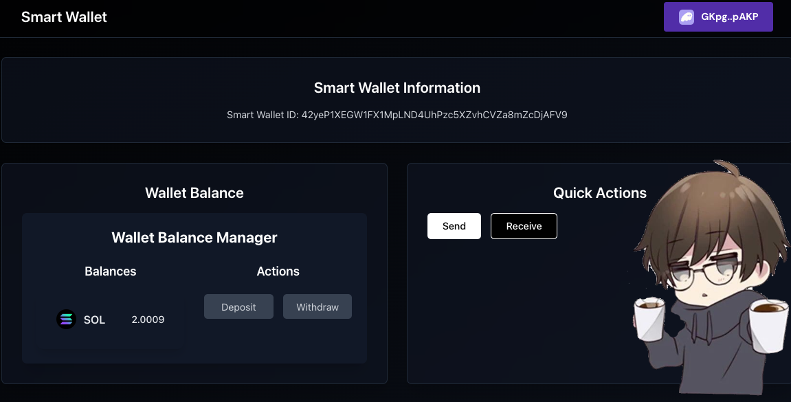
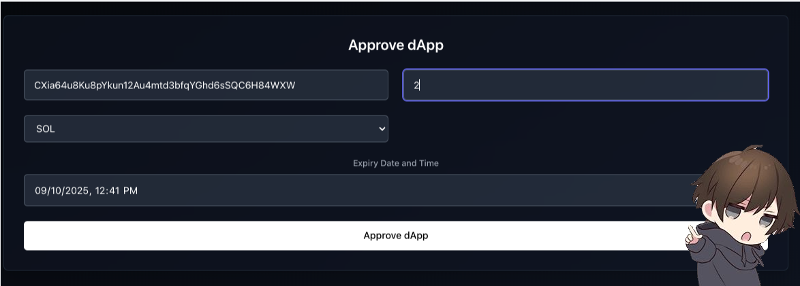
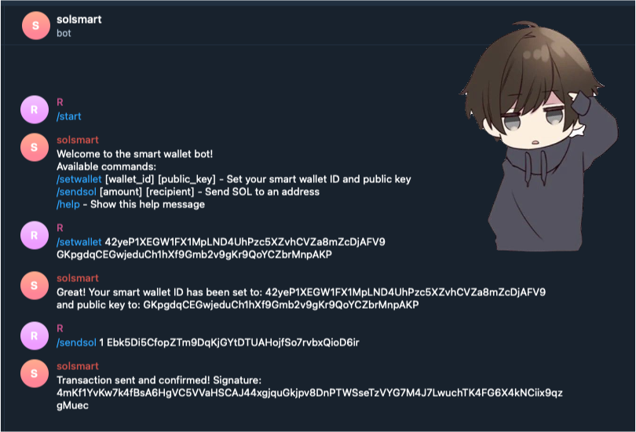

# Smart Wallet Project

The Smart Wallet Project is a decentralized application (dApp) that allows users to manage their cryptocurrency assets securely and efficiently. It combines a user-friendly frontend interface, a robust smart contract, and a convenient Telegram bot for seamless interactions.

## Features

### 1. Secure Asset Management
- Store and manage multiple cryptocurrencies in one place
- Advanced security measures to protect your assets

### 2. Approve Dapps to Auto-Transfer
- Approve dapps to auto-transfer funds from your wallet
- No need to sign every transaction

### 3. Demo Telegram Bot Integration
- Approve Telegram bot to auto-transfer funds from your smart wallet
- Use the telegram bot to send transactions from your smart wallet
- The bot can transfer funds to other wallets from your smart wallet without the need to sign every transaction

