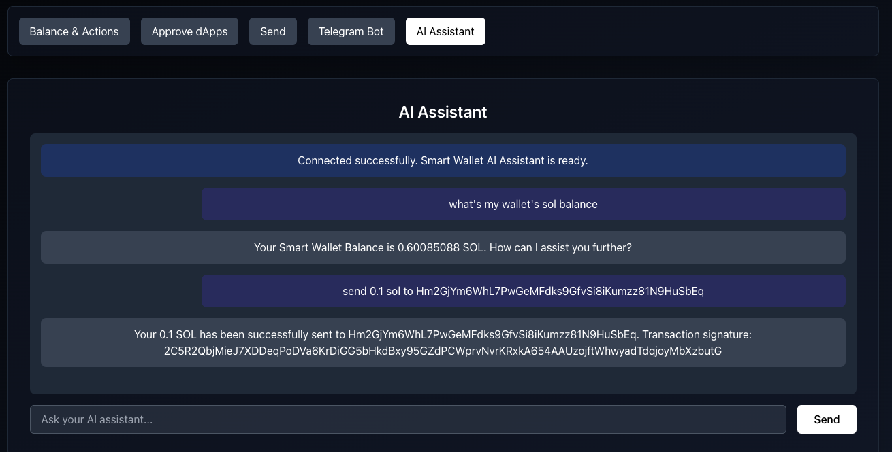

# Soul Wallet 

Secure, Fast, and Intelligent Asset Management

### How it works
The Solana Smart Wallet operates on the Solana blockchain, leveraging its high-speed and low-cost transactions. Here's a brief overview of how it works:

1. Wallet Creation: Users create a smart wallet account on the Solana blockchain.

2. Asset Management: The wallet can hold and manage multiple Solana-based tokens securely.

3. Dapp Approval: Users can approve specific decentralized applications (dapps) to initiate transactions on their behalf.

4. Automated Transactions: Once approved, dapps can execute transactions without requiring the user to sign each one, streamlining the process.

5. Customizable Limits: Users can set transaction limits and rules for each approved dapp, maintaining control while enjoying automation.

The Solana Smart Wallet simplifies blockchain interactions by leveraging smart contract capabilities. This innovative approach creates a user-friendly automated wallet solution. By eliminating the need to sign every transaction, it enhances user experience in various scenarios such as subscriptions (recurring payments), payroll systems, bounty dispensers, and more, making decentralized technologies more accessible and efficient for users. The wallet's design focuses on automation and ease of use, prioritizing convenience in daily blockchain interactions.

## Key Features

### Effortless Approvals
Pre-approve dApp transactions to streamline the user experience.

### Granular Control
Specify spending limits and expiration dates for each dApp approval.

### Secure & Transparent
All approvals are on-chain and verifiable with Soul Wallet.

## Why Choose Soul Wallet?

- **AI-Powered**: Intelligent assistance for all your wallet operations
- **Customizable**: Build and deploy your own AI agents using our SDK
- **Save Time**: No more repeated confirmations—approve once and interact seamlessly
- **Total Control**: Control your assets with intelligent oversight
- **Fully Decentralized**: On-chain verification with AI-enhanced security

## Screenshots

### AI Assistant Interface

### Smart Wallet Dashboard

### dApp Approval Interface

### Telegram Bot Integration

## Getting Started

Visit [Soul Wallet](https://soulwallet.xyz) to launch the app and start experiencing the future of Web3 asset management.
